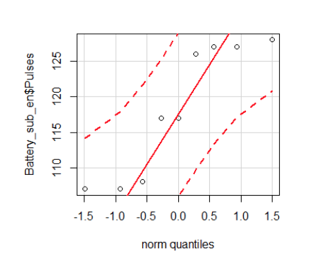

# 2 sample pair /Users/phil/code/tldr/data-science/stats-math1324/09-2sample-pair-sample-t-tests/09-2sample-pair-sample-t-tests.md

the long version

slides
https://docs.google.com/presentation/d/1G3iRXe4ewUx4COETbx6crkwjRu9kEXrSpTzu2LBvQME/edit#slide=id.gbb3a9b653_0_0
worksheet
https://docs.google.com/document/d/1DNCSaMIGrJsO3sfA45xl7_0kXQpnRYg7zNUPyApnCas/edit

If more than 5% of data is falling outside of the Confidence interval,

Line of normality

-

-

Only if CI confidence interval is greater than 0

Since the confidence level doesn't include zero

therefore can't accept null hypothesis
reject it

Welch test
  if not equal variances, then assumes using welch test
  
  
