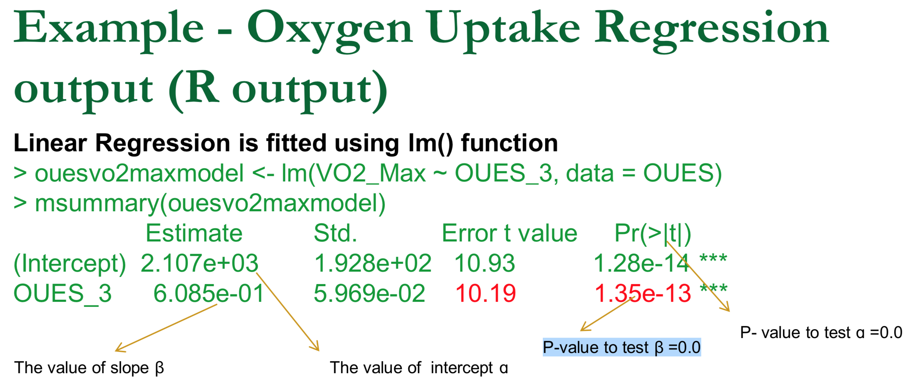

# Linear regression

We look at p value compared to the f

The learning objectives associated with this module are:

Define the common terms of linear regression and correlation.
Explain the concept behind the least squares method for simple linear regression.
Interpret simple scatter plots visualising bivariate data.
Use technology to fit a simple linear regression and perform hypothesis tests of the various model components.
Use technology to test the various assumptions behind linear regression analysis and identify when assumptions are in doubt.
Interpret the output of a simple linear regression analysis.
Use technology to compute the Pearson correlation coefficient and perform hypothesis testing.
Interpret the Pearson correlation coefficient and determine when a correlation can be considered statistically significant.

y - y^ squares

y - estimated area underneath the line

can only 

Pearson correlation

- Is it a positive or negative correlation
`+ or - ` r is sqrt (R^2 = 0. )

## Links

- [class activities]

[class activities]: (https://docs.google.com/document/d/1SFCgbclf55ypY5ZUMamKQ1_ArqZlE0C3lFcfg_flC3w/edit#)

[Module 9 - Intro to Stats](https://sites.google.com/a/rmit.edu.au/intro-to-stats/home/module-9)
