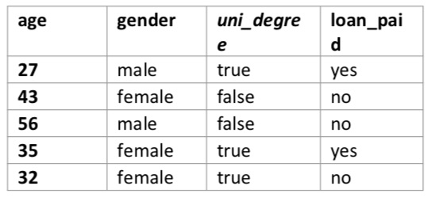
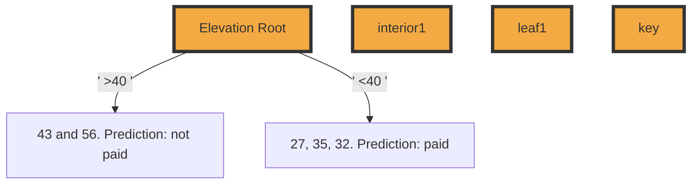
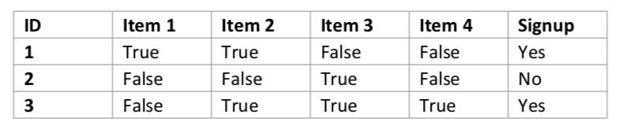
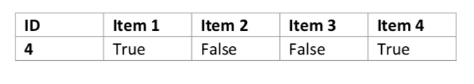

Philip Steinke
s3725547

Problem 1: (40 points) You are given the dataset below with three descriptive features (age, gender, uni_degree) with **loan_paid being the target feature**.


### A) (7 points) 

Compute the **impurity** of this dataset with respect to the target feature if **Entropy** is used.

**Entropy formula:** 
```math
H(t)=-\sum_{i=1}^{1}\left(P(t=i) \times \log _{2}(P(t=i))\right)
```

```
= - sum(Pr(t = paid) + log<sub>2</sub>(t = paid))
= - sum(2/5 * log<sub>2</sub>(2/5))
= - sum(-0.5287)
= -5 * 0.5287
= 2.64
```
==2.64 bits of entropy==

---

### B) (25 points)

Which one of the two descriptive features would you split at the root node if you are to use the Entropy split criterion and decide based on **information gain**: gender or uni_degree? Show all your work.



**Entropy of Partition**
```math
H(t,D)=-\sum _{ l\; \epsilon \; levels(t) }^{ l } \left( Pr(t=l)\times \log _{ 2 } (Pr(t=l)) \right) 
```

#### Gender:

= -Sum(
    Pr(t=paid) * log<sub>2</sub>(Pr(t=paid)) // male
    + Pr(t=paid) * log<sub>2</sub>(Pr(t=paid)) // male
    + Pr(t=unpaid) * log<sub>2</sub>(Pr(t=unpaid)) // female
    + Pr(t=unpaid) * log<sub>2</sub>(Pr(t=unpaid)) // female
  )

= -Sum(
    Pr(male && paid) * log<sub>2</sub>(male && paid))
    + Pr(male && unpaid) * log<sub>2</sub>(male && unpaid)
    + Pr(female && paid) * log<sub>2</sub>(female && paid)
    + Pr(female && unpaid) * log<sub>2</sub>(female && unpaid)
  )

= -Sum(
      1/2 * log<sub>2</sub>(1/2)  // paid male 
    + 1/2 * log<sub>2</sub>(1/2)  // unpaid male
    + 2/3 * log<sub>2</sub>(2/3)  // paid female 
    + 1/3 * log<sub>2</sub>(1/3)  // unpaid female
  )

= 1.92

**REM** Remainder
```math
rem(d,D)=\quad +\sum _{ l\; \epsilon \; levels(d) }^{ l } \underbrace { \frac { \left| { D }_{ d=l } \right|  }{ \left| D \right|  }  }_{ weighting } \times \quad \underbrace { H(t,\quad { D }_{ d=l }) }_{ entropy\, of\, \\ partition\, { D }_{ d=l } } 
```
REM = 3/5 * 1.92
 + 2/5 * 1.92
= 48/92

IG = 1.92 - (48/92)
   = 804/575
   = 1.40

```math
Information Gain: IG(d,\mathcal{D})=H(t,\mathcal{D})-\operatorname{rem}(d,\mathcal{D})
```

```math
=\left(\frac{\left|\mathcal{D}_{\mathrm{GENDER}}=T\right|}{|\mathcal{D}|} \times H\left(t, \mathcal{D}_{\mathrm{GENDER}}=T\right)\right)+\left(\frac{\left|\mathcal{D}_{\mathrm{GENDER}}=F\right|}{|\mathcal{D}|} \times H\left(t, \mathcal{D}_{\mathrm{GENDER}=F}\right)\right)
```


#### Uni degree:

= -Sum(
      Pr(t=paid) * log<sub>2</sub>(Pr(t=paid)) // uni_degree=T
    + Pr(t=paid) * log<sub>2</sub>(Pr(t=paid)) // uni_degree=F
    + Pr(t=unpaid) * log<sub>2</sub>(Pr(t=unpaid)) // uni_degree=T
    + Pr(t=unpaid) * log<sub>2</sub>(Pr(t=unpaid)) // uni_degree=F
  )
= -Sum(
      Pr(uni_degree=T && paid) * log<sub>2</sub>(uni_degree=T && paid))
    + Pr(uni_degree=T && unpaid) * log<sub>2</sub>(uni_degree=T && unpaid)
    + Pr(uni_degree=F && paid) * log<sub>2</sub>(uni_degree=F && paid)
    + Pr(uni_degree=F && unpaid) * log<sub>2</sub>(uni_degree=F && unpaid)

  )
= -Sum(
      2/3 * log<sub>2</sub>(2/3)    // uni_degree=T paid
      1/3 * log<sub>2</sub>(1/3)  // uni_degree=T unpaid
      0/2 * log<sub>2</sub>(0/2)  // uni_degree=F paid
      2/2 * log<sub>2</sub>(2/2)  // uni_degree=F unpaid
  )

= -(-0.9182)
= 0.92

REM
```math
=\left(\frac{\left|\mathcal{D}_{\mathrm{UNIDEGREE}}=T\right|}{|\mathcal{D}|} \times H\left(t, \mathcal{D}_{\mathrm{UNIDEGREE}}=T\right)\right)+\left(\frac{\left|\mathcal{D}_{\mathrm{UNIDEGREE}}=F\right|}{|\mathcal{D}|} \times H\left(t, \mathcal{D}_{\mathrm{UNIDEGREE}=F}\right)\right)
```

REM = 3/5 * 1.92
 + 2/5 * 1.92
= 48/92

IG = 1.92 - (48/92)
   = 804/575
   = 1.40

==Same entropy for both==
==Same REM for both==
==BOTH have the same information gain, and are equally valid, according to the above calculations. We could split either==


---

### C) (8 points)

Suppose you decided to split on the age variable with a cutoff value of 40 and you decided to make only one split at the root node. Draw the corresponding decision tree and label the predictions made at each one of the leaf nodes.




## Problem 2: (20 points) 

You are given the following dataset that describes shopping patterns of 3 customers on 4 items and whether these customers eventually signed up for a loyalty card, which is denoted by the **Signup feature**.



Consider Chapter 5: Similarity-Based Learning in the textbook and recall that

**Sokal-Michener**: ${ Sim }_{ SM }(q,d)\quad =\quad \cfrac { CP(q,d)\quad +\quad CA(q,d) }{ \left| q \right|  } \quad $
- **Sokal-Michiner(x, y)** = ratio of co-presence and co-absence / total binary

What prediction would you make for the following customer in regards to the Signup feature using the Sokal-Michener similarity index? Show all your work for full credit.


**Sokal-Michener**: ${ Sim }_{ SM }(q,d)\quad =\quad \cfrac { CP(q,d)\quad +\quad CA(q,d) }{ \left| q \right|  } \quad $
- **Sokal-Michiner(x, y)** = ratio of co-presence and co-absence / total binary

ID 1:
| dataset           |          | >        | q       |
| ----------------- | -------- | -------- | ------- |
|                   |          | presence | absence |
| **d<sub>1</sub>** | presence | CP = 1   | PA      |
| ^                 | absence  | AP       | CA = 1  |

= 1 + 1 / 4

= 0.5


ID 2:
| dataset           |          | >        | q       |
| ----------------- | -------- | -------- | ------- |
|                   |          | presence | absence |
| **d<sub>1</sub>** | presence | CP = 0   | PA      |
| ^                 | absence  | AP       | CA = 1  |

1 + 0 / 4
= 0.25
ID 3:
| dataset           |          | >        | q       |
| ----------------- | -------- | -------- | ------- |
|                   |          | presence | absence |
| **d<sub>1</sub>** | presence | CP = 1   | PA      |
| ^                 | absence  | AP       | CA = 0  |

1 + 0 / 4
= 0.25

Closest match is ID1 via Sokal-Michener

Prediction: Signup, similar to ID1
 


---

## Problem 3: (25 points, 5 points each) 

Fill in the blanks with no more than a few words.
1. In a certain class of machine learning problems, there are only **descriptive features** and **no particular target feature**. This class of machine learning problems is known as
_unsupervised_.
2. There are two kinds of mistakes that can be made in a prediction modelling problem. The first kind of mistake is that the prediction model selected by the algorithm is **too simplistic to represent the underlying relationship** between the descriptive feature and the target feature. This kind of mistake is called _Underfitting_
3. There are two kinds of mistakes that can be made in a prediction modelling problem. The second type of mistake is that the prediction model selected by the algorithm is so complex that the model fits to the dataset too closely and becomes sensitive to the noise in the data. This kind of mistake is called _Overfitting_
TODO: 4. In many cases, a unique solution cannot be determined using only the information available in a machine learning problem. This is why machine learning is considered as _local search_ problem.
5. The set of assumptions that define the model selection criteria of a machine learning algorithm is known as _Inductive Bias_

## Problem 4: (15 points, 3 points each) 

For each one of the scenarios below, circle whether the nearest neighbor (NN) or the decision tree (DT) method would be preferable in general. If you circle both choices for a scenario, you will not receive any points.

NOTE: 4. Done
1. **DT**: There are many irrelevant descriptive features in the training data.
2. **DT** The underlying process is relatively stable and you do not want to continuously re-train the learner as new data becomes available.
3.  **DT**: There are a large number of observations in the training data and you would like to make a prediction rather quickly.
4. **NN**: You would like to use a lazy learner.
5. Circle the correct answer: **True** / False: I wrote my name and student ID in a legible manner
on the top of all pages where indicated.