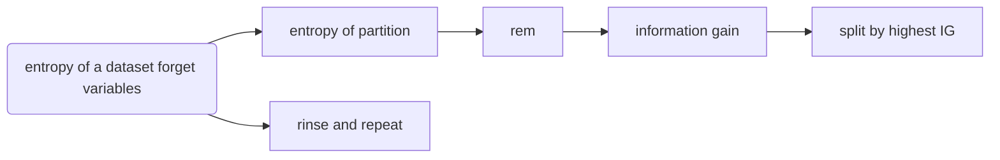
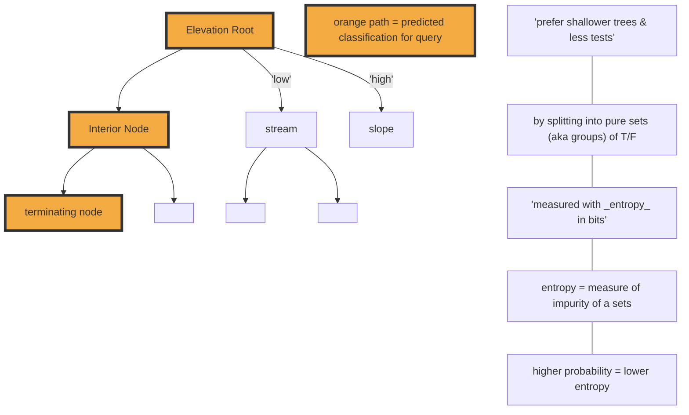

#### Final Cheatsheet
- ==TODO:== supervised vs unsupervised:
  unsupervised => no target (aka response variable)

**Entropy** 
```math
H(t)=-\sum_{i=1}^{1}\left(P(t=i) \times \log _{2}(P(t=i))\right)
```
eg. Probability of card = 0.019 (1/52)
= -Sum(Pr(0.019) * log2(Pr(0.019))) = 5.7 bits

- [ ] **Entropy of Partition**
```math
H(t,D)=-\sum _{ l\; \epsilon \; levels(t) }^{ l } \left( Pr(t=l)\times \log _{ 2 } (Pr(t=l)) \right) 
```

**Eg. Family Partition Entropy**
```
= - Pr(t(low) = yes) x log2(Pr(t(low) = yes)) +
Pr(t(low) = no) x log2(Pr(t(low) = no)) + 
Pr(t(high) = yes) x log2(Pr(t(high) = yes)) +
Pr(t(high) = no) x log2(Pr(t(high) = no))
= - 1/2 * log2(1/2) + 
1/2 * log2(1/2) +
2/3 * log2(2/3) +
1/3 * log2(1/3)
= 1.918
```
- [ ] **REM** Remainder
```math
rem(d,D)=\quad +\sum _{ l\; \epsilon \; levels(d) }^{ l } \underbrace { \frac { \left| { D }_{ d=l } \right|  }{ \left| D \right|  }  }_{ weighting } \times \quad \underbrace { H(t,\quad { D }_{ d=l }) }_{ entropy\, of\, \\ partition\, { D }_{ d=l } } 
```
==TODO: Eg.==
**How**
- Get fraction of answers that will be true vs false from col
- Fraction of those that True -> spam 
- & fraction that true -> ham
- Fraction that false -> spam + fraction goes to ham 
- Do log above to it

```math
Information Gain: IG(d,\mathcal{D})=H(t,\mathcal{D})-\operatorname{rem}(d,\mathcal{D})
```
```math
IG ratio: GR(t,\mathcal{D}) = { \frac { IG(d,\mathcal{D})  }{ H(t,\mathcal{D})  }  }
```

**Gini index** = how often misclassify an instance in a dataset
- if you classified it based on the distribution of the classification in the dataset

```math
gini(t,D)=1\, -\sum _{ l\; \epsilon \; levels(t) }^{ l } \underbrace { { Pr(t=l) }^{ 2 } }_{ TODO } \\ =1\, -\sum _{ l\; \epsilon \; \left\{ \begin{matrix} 'chapparian' \\ 'riparian' \\ 'conifer' \end{matrix} \right\}  }^{ l } \underbrace { { Pr(t=l) }^{ 2 } }_{ TODO } \\ =1\quad -\quad \left( { \frac { 3 }{ 7 }  }^{ 2 }+{ \frac { 2 }{ 7 }  }^{ 2 }+{ \frac { 2 }{ 7 }  }^{ 2 } \right) \\ =0.653
```



- choose the majority when splitting decision tree roots
- TODO: don't forget equality!
- **Inductive Bias** = The set of assumptions that defines the model selection criteria of a ML algorithms

## Model Ensembles

**Boosting** = New model biased to pay more attention to instances that previous models misclassified
  - uses a weighted dataset

**Bagging** = each model in ensemble is trained on random sample of dataset
  - sampling with replacement is used
  - each sample, therefore each model is different
  - aka boostrap aggregating

### Co-presence / Co-absence Formulas

| dataset           |          | >        | q       |
| ----------------- | -------- | -------- | ------- |
|                   |          | presence | absence |
| **d<sub>1</sub>** | presence | CP = 2   | PA = 0  |
| ^                 | absence  | AP = 1   | CA = 1  |

==NOTE: NOT alphabetical d->q==
AP: absense(q)presence(d) = 0

#### Formulas
**Russel-Rao**: ${ Sim }_{ RR }(q,d)\quad =\quad \cfrac { CP(q,d) }{ \left| q \right|  } \quad $
- **Russel-rao(x, y)** = ratio of co-presence / total binary

**Sokal-Michener**: ${ Sim }_{ SM }(q,d)\quad =\quad \cfrac { CP(q,d)\quad +\quad CA(q,d) }{ \left| q \right|  } \quad $
- **Sokal-Michiner(x, y)** = ratio of co-presence and co-absence / total binary

**Jaccard**: ${ Sim }_{ J }(q,d)= \cfrac { CP(q,d) }{ CP(q,d)+PA(q,d)+AP(q,d) }$
- **Jaccard(x,y)** = ignores co-absence altogether

$\text {Euclidean}(\mathbf{a}, \mathbf{b})=\sqrt{\sum_{i=1}^{m}(\mathbf{a}[i]-\mathbf{b}[i])^{2}}$

$\operatorname{Minkowski}(\mathbf{a}, \mathbf{b})=\left(\sum_{i=1}^{m} a b s(\mathbf{a}[i]-\mathbf{b}[i])^{p}\right)^{\frac{1}{\rho}}$

$\text {Manhattan}(\mathbf{a}, \mathbf{b})=\sum_{i=1}^{m} \operatorname{abs}(\mathbf{a}[i]-\mathbf{b}[i])$

| Neural Network                      | Decision Tree                           |
| ----------------------------------- | --------------------------------------- |
| lazy learner                        | Eager learners                          |
|                                     | underlying process is relatively stable |
| if adding new obs. to training data | do not want to continuously retrain     |
|                                     | If irrelevant descriptive features      |
| noisy data                          | noisy data                              |
| TODO: if concept drift              | want fast predictions                   |
| ^                                   | OR large number of observations         |
| if numeric data                     | if mix of numeric & categorical         |
| ^                                   | && want minimise preprocessing          |


### Nearest Neighbour
$\mathbb{M}_{k}(\mathbf{q})=\underset{l \in \text {lelevels}(t)}{\operatorname{argmax}} \sum_{i=1}^{k} \delta\left(t_{i}, l\right)$

### Weighted Nearest Neighbour
$\mathbb{M}_{k}(\mathbf{q})=\underset{l \in \operatorname{levels}(t)}{\operatorname{argmax}} \sum_{i=1}^{k} \frac{1}{\operatorname{dist}\left(\mathbf{q}, \mathbf{d}_{\mathbf{i}}\right)^{2}} \times \delta\left(t_{i}, I\right)$

### Normalisation

$a_{i}^{\prime}=\frac{a_{i}-\min (a)}{\max (a)-\min (a)} \times(h i g h-l o w)+l o w$