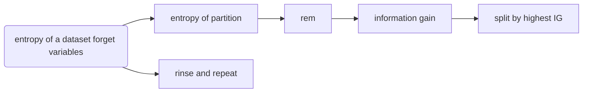
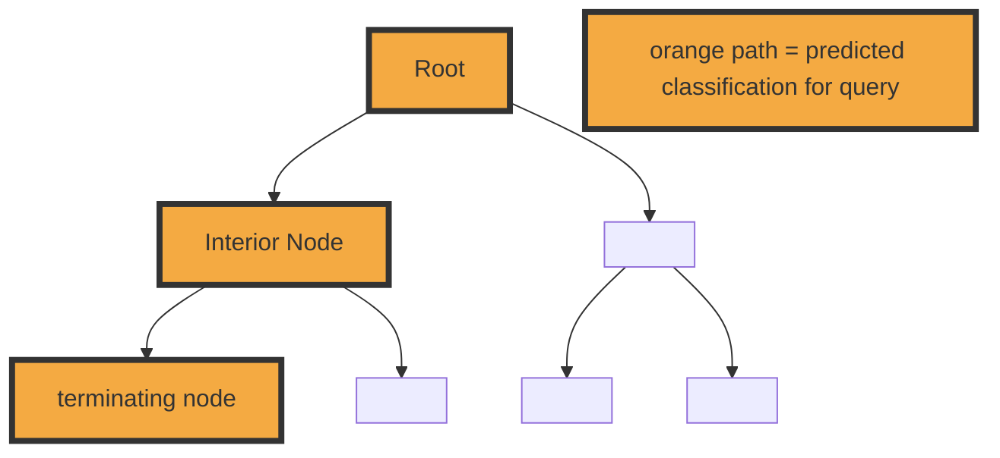

# Final Cheatsheet:


- TODO: supervised vs unsupervised:
  unsupervised => no target (aka response variable)

## TODO: Examples of each formula

## Formulas:
- [ ] **Entropy** 
```math
H(t)=-\sum_{i=1}^{1}\left(P(t=i) \times \log _{2}(P(t=i))\right)
```
**Eg.**

- [ ] **Entropy of Partition**
```math
H(t,D)=-\sum _{ l\; \epsilon \; levels(t) }^{ l } \left( Pr(t=l)\times \log _{ 2 } (Pr(t=l)) \right) 
```
**Eg.**

- [ ] **REM**
```math
rem(d,D)=\quad +\sum _{ l\; \epsilon \; levels(d) }^{ l } \underbrace { \frac { \left| { D }_{ d=l } \right|  }{ \left| D \right|  }  }_{ weighting } \times \quad \underbrace { H(t,\quad { D }_{ d=l }) }_{ entropy\, of\, \\ partition\, { D }_{ d=l } } 
```
**Eg.**
- [ ] **Info gain**
```math
IG(d,\mathcal{D})=H(t,\mathcal{D})\operatorname{rem}(d,\mathcal{D})
```
**Eg.**
- [ ] **IG ratio**
```math
GR(t,\mathcal{D}) = { \frac { IG(d,\mathcal{D})  }{ H(t,\mathcal{D})  }  }
```
**Eg.**

- [ ] **Gini Index**
```math
gini(t,D)=\quad 1\, - \sum _{ l\; \epsilon \; levels(t) }^{ l } \underbrace { { Pr(t=l) }^{ 2 } }_{ TODO } 
```
**Eg.**
- Gini index = how often misclassify an instance in a dataset
  - if you classified it based on the distribution of the classification in the dataset



- choose the majority when splitting decision tree roots
- TODO: don't forget equality!
- **Inductive Bias** = The set of assumptions that defines the model selection criteria of a ML algorithms

## Model Ensembles

**Boosting** = New model biased to pay more attention to instances that previous models misclassified
  - uses a weighted dataset

**Bagging** = each model in ensemble is trained on random sample of dataset
  - sampling with replacement is used
  - each sample, therefore each model is different
  - aka boostrap aggregating

## TODO: better name? Co-presence / Co-absence Formulas

| dataset           |          | >        | q       |
| ----------------- | -------- | -------- | ------- |
|                   |          | presence | absence |
| **d<sub>1</sub>** | presence | CP = 2   | PA = 0  |
| ^                 | absence  | AP = 1   | CA = 1  |

==NOTE: NOT alphabetical d->q==
AP: absense(q)presence(d) = 0

- [ ] **Russel-Rao**: ${ Sim }_{ RR }(q,d)\quad =\quad \cfrac { CP(q,d) }{ \left| q \right|  } \quad $
- [ ] **Sokal-Michener**: ${ Sim }_{ SM }(q,d)\quad =\quad \cfrac { CP(q,d)\quad +\quad CA(q,d) }{ \left| q \right|  } \quad $
- [ ] **Jaccard**: ${ Sim }_{ J }(q,d)= \cfrac { CP(q,d) }{ CP(q,d)+PA(q,d)+AP(q,d) }$

- [ ] Euclidian $\text {Euclidean}(\mathbf{a}, \mathbf{b})=\sqrt{\sum_{i=1}^{m}(\mathbf{a}[i]-\mathbf{b}[i])^{2}}$
- [ ] Minowski $\operatorname{Minkowski}(\mathbf{a}, \mathbf{b})=\left(\sum_{i=1}^{m} a b s(\mathbf{a}[i]-\mathbf{b}[i])^{p}\right)^{\frac{1}{\rho}}$

- [ ] Manhattan distance TODO:

| Neural Network                      | Decision Tree                           |
| ----------------------------------- | --------------------------------------- |
| lazy learner                        | Eager learners                          |
|                                     | underlying process is relatively stable |
| if adding new obs. to training data | do not want to continuously retrain     |
|                                     | If irrelevant descriptive features      |
| noisy data                          | noisy data                              |
| TODO: if concept drift              | want fast predictions                   |
| ^                                   | OR large number of observations         |
| if numeric data                     | if mix of numeric & categorical         |
| ^                                   | && want minimise preprocessing          |


**Log using calculator** = `log(x)/ log(2)`
**Eg.** Log<sub>2</sub>(0.19) = log(0.19)/log(2)
___________________________




- !prefer shallower trees
  - with less tests
- by splitting into pure sets (aka groups) of T/F
  - measured with _entropy_ in bits

### Entropy

- = measure of impurity of a sets
- probability of outcome
- :fa-long-arrow-up: probability = :fa-long-arrow-down: entropy
- :fa-long-arrow-down: probability = :fa-long-arrow-up: entropy


___________________________


# TODO:
[ ] Chapter 1
[ ] Chapter 4
[ ] Chapter 5

## Practice Test:

1. 
  [ ] a. total entropy
  [ ] b. Which feature would you split at the node if you used the info gain?
  [ ] c. draw a decision tree
    [ ] label predictions
  
2. Which model to choose? Rusell, Sokal, Jaccard?
  [ ] a. Summarise detailed below
  [ ] b. Summarise detailed below

3.   

------------------  

# Detailed answers:

Source: [detailed notes on this question](../w06-probability-based-learning/w06-probability-based-learning__notes-and-tasks.md)


## Problem 1: (30 points) 

You are given the dataset below with three descriptive features (Smoker, Obese, Family) with Risk being the target feature.


### A) (5 points) 
What is the **total entropy** of this dataset?


### B) (20 points) 
Which one of the two descriptive features would you split at the root node if you are to use the **Information gain split** criterion: Family or Smoker? Show all your work.

### C) (5 points) 
Suppose you decided to split on the Obese variable and you decided to make only **one split at the root node**. Draw the corresponding **decision tree** and **label the predictions** made at each one of the leaf nodes.

______________________________________________________________


## Problem 2: (20 points) 

- binary: bought/not bought

You would like to build a **recommender system** for a large online shop that has a stock of over thousands of items. In this domain, the behavior of customers is captured in terms of what items they have bought or not bought. For example, the following table lists the behavior of three customers in this domain for a subset of four items.

#### A) (5 points) 
The company has decided to use a **similarity-based model** to implement the recommender system. Which of the following **three similarity indexes** do you think the system should be based on and why? Explain your choice in no more than one sentence.

Answer: ==Russel Rao==, because they want to include what is not bought, and the other models do not account for **co-absence**
> the behavior of customers is captured in terms of what items they have bought or not bought

TODO: formulas
- **Russel-rao(x, y)** = ratio of co-presence / total binary
- **Sokal-Michiner(x, y)** = ratio of co-presence and co-absence / total binary
- **Jaccard(x,y)** = ignores co-absence altogether


#### B) (15 points) What items will the system recommend to the following customer?

- Assume that the recommender system uses the Russel-Rao similarity index and the system is trained on the sample dataset with three observations listed above. 
- Also assume that the system generates recommendations by
  - **recommending the items that the most similar customer has bought** 
  - but that the **query customer has not bought**.
- Finally, assume that ties are broken by selecting the customer with the highest number of purchases. Show all your work for full credit.

**What would happen with this customer? #4**

Shorter version:

Russel-Rao(X,Y) = CP / P = Copresence / total

P = 4

#### d1
CP = 2
Russel-Rao(X,Y) = 2/4 = 0.5

#### d2
CP = 1

Russel-Rao(X,Y) = 1/4 = 0.25

#### d3
CP = 3
Russel-Rao(X,Y) = 2/4 = 0.75

Therefore: **d3 is most similar**

Which items would the system recommend?
**Item #2**
because Item #1, #3, #4 have been bought by both `d3` and `Q`

(Q)uery | Item 1 | Item 2 | Item 3 | Item 4
--------|--------|--------|--------|-------
4       | True   | False  | True   | True


(D)ataset | Item 1 | Item 2 | Item 3 | Item 4
----------|--------|--------|--------|-------
1         | True   | False  | True   | False
2         | True   | False  | False  | False
3         | True   | True   | True   | True

#### d1

CP: Co-presence: x2 (item #1, #3)
CA: Co-absence: x1 (item #2)
PA: presence(q)absense(d) = 1 (item #4)
==NOTE: NOT alphabetical d->q==
AP: absense(q)presence(d) = 0

| dataset           |          | >                  | q               |
| ----------------- | -------- | ------------------ | --------------- |
|                   |          | presence           | absence         |
| **d<sub>1</sub>** | presence | CP = 2 (item 1, 3) | PA = 0          |
| ^                 | absence  | AP = 1 (item 4)    | CA = 1 (item 2) |


#### d2

CP: Co-presence: x1 (item #1)
CA: Co-absence: x1 (item #2)
PA: presence(q)absense(d) = 2 (item #3, #4)
AP: absense(q)presence(d) = 0 ()

| dataset           |          | >                | q                    |
| ----------------- | -------- | ---------------- | -------------------- |
|                   |          | presence         | absence              |
| **d<sub>1</sub>** | presence | CP = 1 (item #1) | PA = 2 (item #3, #4) |
| ^                 | absence  | AP = 0           | CA = 1 (item #2)     |

#### d3

CP: Co-presence: x2 (item #1 #3)
CA: Co-absence: x1 (item #2)
PA: presence(q)absense(d) = 1 (item #2)
AP: absense(q)presence(d) = 0

| dataset           |          | >             | q                |
| ----------------- | -------- | ------------- | ---------------- |
|                   |          | presence      | absence          |
| **d<sub>1</sub>** | presence | CP = 2 (item) | PA = 1 (item #2) |
| ^                 | absence  | AP = 0        | CA = 1 (item #2) |

| dataset           |          | >        | q       |
| ----------------- | -------- | -------- | ------- |
|                   |          | presence | absence |
| **d<sub>1</sub>** | presence | CP =     | PA =    |
| ^                 | absence  | AP =     | CA =    |

<!-- **(empty copy)**

| dataset           |          | >        | q       |
| ----------------- | -------- | -------- | ------- |
|                   |          | presence | absence |
| **d<sub>1</sub>** | presence | CP =     | PA =    |
| ^                 | absence  | AP =     | CA =    | -->


