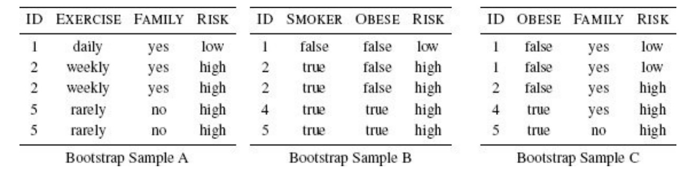
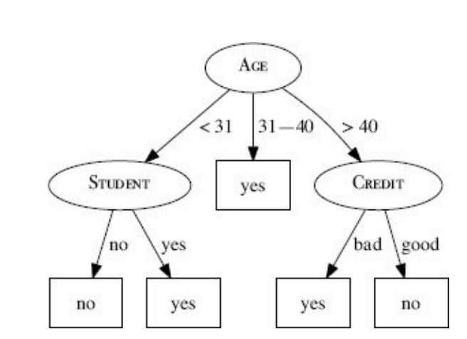

4.7 Exercises

1. The image below shows a set of eight Scrabble pieces. `OXYMORON`

a. What is the entropy in bits of the letters in this set?
b. What would be the reduction in entropy (i.e., the information gain) in bits if we
split these letters into two sets, one containing the vowels and the other containing
the consonants?
c. What is the maximum possible entropy in bits for a set of eight Scrabble pieces?
d. In general, which is preferable when you are playing Scrabble: a set of letters with
high entropy or a set of letters with low entropy?

2. A convicted criminal who reoffends after release is known as a recidivist. The
table below lists a dataset that describes prisoners released on parole, and whether they
reoffended within two years of release.


| ID  | GOOD  | BEHAVIOR | AGE < | 30 DRUG DEPENDENT RECIDIVIST |
| --- | ----- | -------- | ----- | ---------------------------- |
| 1   | false | true     | false | true                         |
| 2   | false | false    | false | false                        |
| 3   | false | true     | false | true                         |
| 4   | true  | false    | false | false                        |
| 5   | true  | false    | true  | true                         |
| 6   | true  | false    | false | false                        |

- This dataset lists six instances where prisoners were granted parole. 
- Each of these instances are described in terms of three binary descriptive features 
`(GOOD BEHAVIOR, AGE < 30, DRUG DEPENDENT)` and a binary target feature, RECIDIVIST. 
- The GOOD BEHAVIOR feature algorithm, using entropy-based information gain.

a. Using this dataset, construct the decision tree that would be generated by ID3
b. What prediction will the decision tree generated in part (a) of this question return
for the following query?

```
GOOD BEHAVIOR = false, AGE < 30 = false,
DRUG DEPENDENT = true
```
c. What prediction will the decision tree generated in part (a) of this question return
for the following query?
```
GOOD BEHAVIOR = true, AGE < 30 = true,
DRUG DEPENDENT = false
```

3. The table below lists a sample of data from a census.

| ID  | AGE | EDUCATION   | MARITAL STATUS | OCCUPATION   | ANNUAL INCOME |
| --- | --- | ----------- | -------------- | ------------ | ------------- |
| 1   | 39  | bachelors   | never married  | transport    | 25K–50K       |
| 2   | 50  | bachelors   | married        | professional | 25K–50K       |
| 3   | 18  | high school | never married  | agriculture  | ≤ 25K         |
| 4   | 28  | bachelors   | married        | professional | 25K–50K       |
| 5   | 37  | high school | married        | agriculture  | 25K–50K       |
| 6   | 24  | high school | never married  | armed forces | ≤ 25K         |
| 7   | 52  | high school | divorced       | transport    | 25K–50K       |
| 8   | 40  | doctorate   | married        | professional | ≥ 50K         |

There are four descriptive features and one target feature in this dataset:
AGE, a continuous feature listing the age of the individual
EDUCATION, a categorical feature listing the highest education award achieved by
the individual (high school, bachelors, doctorate)
MARITAL STATUS (never married, married, divorced)
OCCUPATION (transport = works in the transportation industry; professional =
doctors, lawyers, etc.; agriculture = works in the agricultural industry; armed
forces = is a member of the armed forces)
ANNUAL INCOME, the target feature with 3 levels (<25K, 25K–50K, >50K)

a. Calculate the entropy for this dataset.

b. Calculate the Gini index for this dataset.

c. When building a decision tree, the easiest way to handle a continuous feature is to
define a threshold around which splits will be made. What would be the optimal
threshold to split the continuous AGE feature (use information gain based on entropy
as the feature selection measure)?

d. Calculate information gain (based on entropy) for the EDUCATION, MARITAL
STATUS, and OCCUPATION features.

e. Calculate the information gain ratio (based on entropy) for EDUCATION, MARITAL
STATUS, and OCCUPATION features.

f. Calculate information gain using the Gini index for the EDUCATION, MARITAL
STATUS, and OCCUPATION features.

4. The diagram below shows a decision tree for the task of predicting heart
disease. The descriptive features in this domain describe whether the patient suffers
from chest pain (CHEST PAIN) as well as the blood pressure of the patient (BLOOD
PRESSURE). The binary target feature is HEART DISEASE. The table beside the diagram
lists a pruning set from this domain.

Using the pruning set, apply reduced error pruning to the decision tree. Assume that
the algorithm is applied in a bottom-up, left-to-right fashion. For each iteration of the
algorithm, indicate the subtrees considered as pruning candidates, explain why the
algorithm chooses to prune or leave these subtrees in the tree, and illustrate the tree
that results from each iteration.

5. The following table lists a dataset containing the details of five participants in a
heart disease study, and a target feature RISK which describes their risk of heart
disease. Each patient is described in terms of four binary descriptive features

**EXERCISE**, how regularly do they exercise
**SMOKER**, do they smoke
**OBESE**, are they overweight
**FAMILY**, did any of their parents or siblings suffer from heart disease

| ID  | EXERCISE | SMOKER | OBESE | FAMILY | RISK |
| --- | -------- | ------ | ----- | ------ | ---- |
| 1   | daily    | false  | false | yes    | low  |
| 2   | weekly   | true   | false | yes    | high |
| 3   | daily    | false  | false | no     | low  |
| 4   | rarely   | true   | true  | yes    | high |
| 5   | rarely   | true   | true  | no     | high |

a. As part of the study researchers have decided to create a predictive model to screen
participants based on their risk of heart disease. You have been asked to implement
this screening model using a random forest. The three tables below list three
bootstrap samples that have been generated from the above dataset. Using these
bootstrap samples create the decision trees that will be in the random forest model
(use entropy based information gain as the feature selection criterion).



b. Assuming the random forest model you have created uses majority voting, what
prediction will it return for the following query:

`EXERCISE=rarely, SMOKER=false, OBESE=true, FAMILY=yes`

6. ✻ The following table lists a dataset containing the details of six patients. Each
patient is described in terms of three binary descriptive features (OBESE, SMOKER, and
DRINKS ALCOHOL) and a target feature (CANCER RISK).

5 false true false low
6 false true true high

a. Which of the descriptive features will the ID3 decision tree induction algorithm
choose as the feature for the root node of the decision tree?

b. When designing a dataset, it is generally a bad idea if all the descriptive features are
indicators of the target feature taking a particular value. For example, a potential
criticism of the design of the dataset in this question is that all the descriptive
features are indicators of the CANCER RISK target feature taking the same level, high.

Can you think of any descriptive features that could be added to this dataset that are
indicators of the low target level?

✻ 7. The following table lists a dataset collected in an electronics shop showing
details of customers and whether they responded to a special offer to buy a new laptop.

| ID  | AGE     | INCOME | STUDENT | CREDIT | BUYS |
| --- | ------- | ------ | ------- | ------ | ---- |
| 1   | < 31    | high   | no      | bad    | no   |
| 2   | < 31    | high   | no      | good   | no   |
| 3   | 31 − 40 | high   | no      | bad    | yes  |
| 4   | > 40    | med    | no      | bad    | yes  |
| 5   | > 40    | low    | yes     | bad    | yes  |
| 6   | > 40    | low    | yes     | good   | no   |
| 7   | 31 − 40 | low    | yes     | good   | yes  |
| 8   | < 31    | med    | no      | bad    | no   |
| 9   | < 31    | low    | yes     | good   | yes  |
| 10  | > 40    | med    | yes     | bad    | yes  |
| 11  | < 31    | med    | yes     | good   | yes  |
| 12  | 31 − 40 | med    | no      | good   | yes  |
| 13  | 31 − 40 | high   | yes     | bad    | yes  |
| 14  | > 40    | med    | no      | good   | no   |

This dataset has been used to build a decision tree to predict which customers will
respond to future special offers. The decision tree, created using the ID3 algorithm, is
shown below.



a. The information gain (calculated using entropy) of the feature AGE at the root node
of the tree is 0.247. A colleague has suggested that the STUDENT feature would be
better at the root node of the tree. Show that this is not the case.
b. Yet another colleague has suggested that the ID feature would be a very effective at
the root node of the tree. Would you agree with this suggestion?

✻ 8. This table lists a dataset of the scores students achieved on an exam described
in terms of whether the student studied for the exam (STUDIED) and the energy level of
the lecturer when grading the student’s exam (ENERGY).

| ID  | STUDIED | ENERGY | SCORE |
| --- | ------- | ------ | ----- |
| 1   | yes     | tired  | 65    |
| 2   | no      | alert  | 20    |
| 3   | yes     | alert  | 90    |
| 4   | yes     | tired  | 70    |
| 5   | no      | tired  | 40    |
| 6   | yes     | alert  | 85    |
| 7   | no      | tired  | 35    |

Which of the two descriptive features should we use as the testing criterion at the root
node of a decision tree to predict students’ scores?

✻ 9. Calculate the probability of a model ensemble that uses simple  
voting making an incorrect prediction in the following scenarios. (Hint: Understanding
how to use the binomial distribution will be useful in answering this question.)

a. The ensemble contains 11 independent models, all of which have an error rate of 0.2.

b. The ensemble contains 11 independent models, all of which have an error rate of 0.49.

c. The ensemble contains 21 independent models, all of which have an error rate of 0.49