import { CodeSurfer } from "mdx-deck-code-surfer"
import { dark } from "mdx-deck/themes"
import nightOwl from "prism-react-renderer/themes/nightOwl"
import Layout from './layout.js';
import { Appear, Image, Notes } from "mdx-deck";

import assignment03 from '!raw-loader!./snippets/assignment03.mdx';
import linearModel from '!raw-loader!./snippets/linearModel.mdx';
import residualModel from '!raw-loader!./snippets/residualModel.mdx';
import quadraticModel from '!raw-loader!./snippets/quadraticModel.mdx';
import logTransformAndDiff from '!raw-loader!./snippets/logTransformAndDiff.mdx';
import garchModel from '!raw-loader!./snippets/garchModel.mdx';
import forecasting from '!raw-loader!./snippets/forecasting.mdx';
import cheating from '!raw-loader!./snippets/cheating.mdx';

export default Layout

export { components } from "mdx-deck-code-surfer"
export const theme = {
  ...dark,
  codeSurfer: {
    ...nightOwl,
    showNumbers: false
  }
}

# Time Series Next Top Model
## Bitcoin TimeSeries
Phil Steinke s3725547 
 Ash Olney s3686808

# <🏄/>

Source: coinmarketcap.com  
Daily closing price of bitcoin

from the 27th of April 2013 to the 24th of February 2019. 

---
### The Initial Data
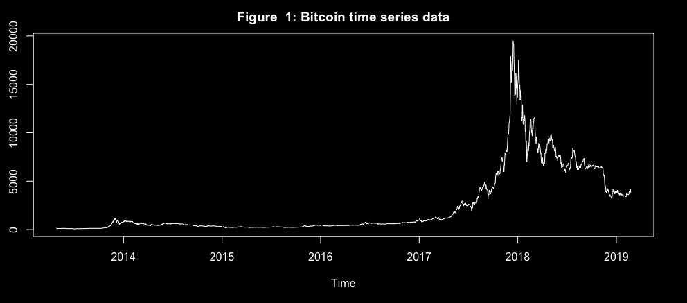
<Notes>
#### The Initial Data:
- There is no overall trend
- There was positive trend until late 2017
- No obvious seasonality
- There looks like there could be an intervention point after the start of 2017
- It is evident from the plot that there are changes in variance throughout the series
- There are clusters of high and low variance
</Notes>
---

If the shoe fits...

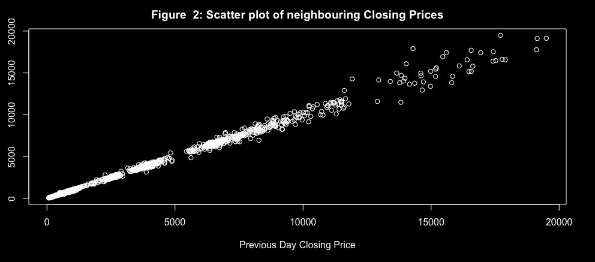
<Notes>
99.76
The high correlation of the data with the first lag shows that successive data points are related
</Notes>
---

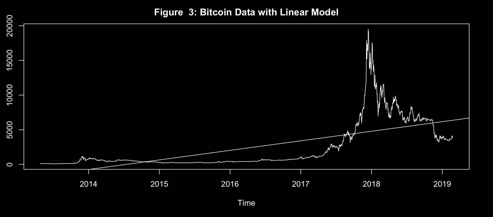

---
<Notes>
### Linear trend model

- The linear model has a positive trend
- The R-Squared value of 0.47 is relatively low
- This model only explains 47% of variation in the data

</Notes>

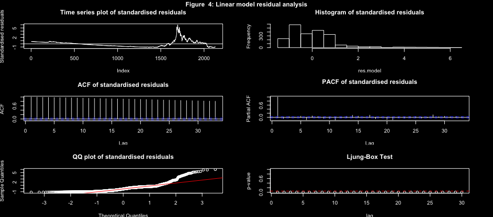

<Notes>
- The data isn't captured by the linear model
- The residuals are not normally distributed
</Notes>
---

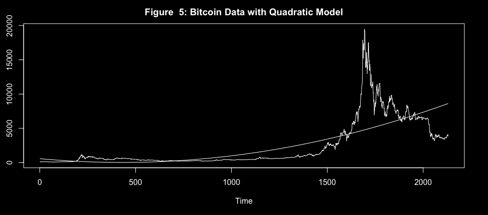

---
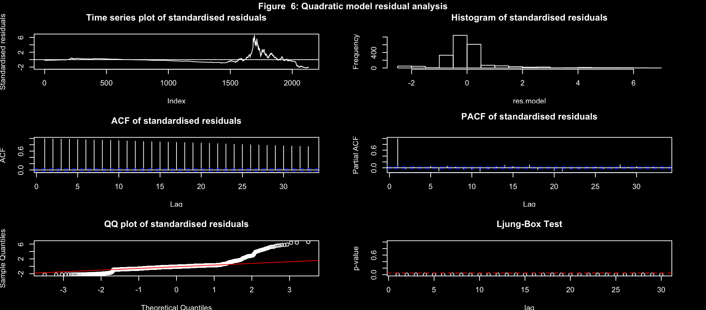

<Notes>
- need to make the data stationary to fit ARIMA models
- The data isn't captured by the quadratic model
- The residuals are not normally distributed
</Notes>
---

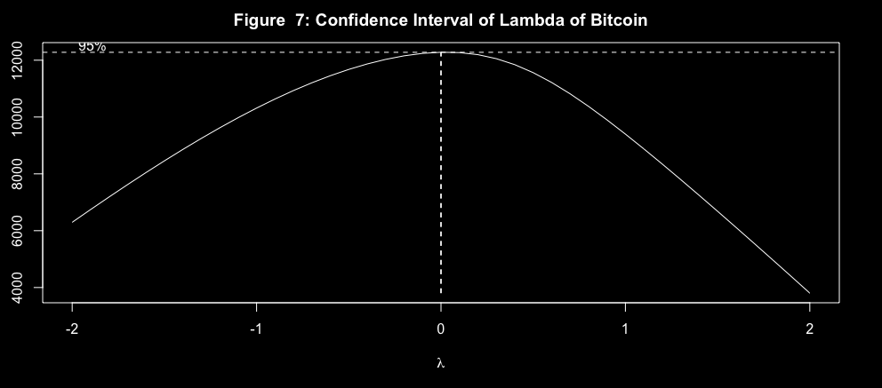

<Notes>
- Lambda = 0 therefore log transformation
</Notes>
---

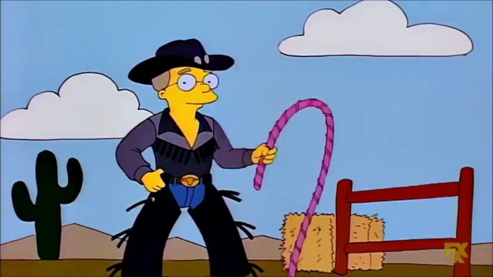

---
<CodeSurfer
  title="log Transform and Diff"
  code={logTransformAndDiff}
  steps={[
    { range: [ 1, 3 ], notes: "Diff = 0" },
    { range: [ 5, 7 ], notes: "Diff = 1" },
    { range: [ 9, 10 ], notes: "Diff = 2" },
  ]}
/>

---

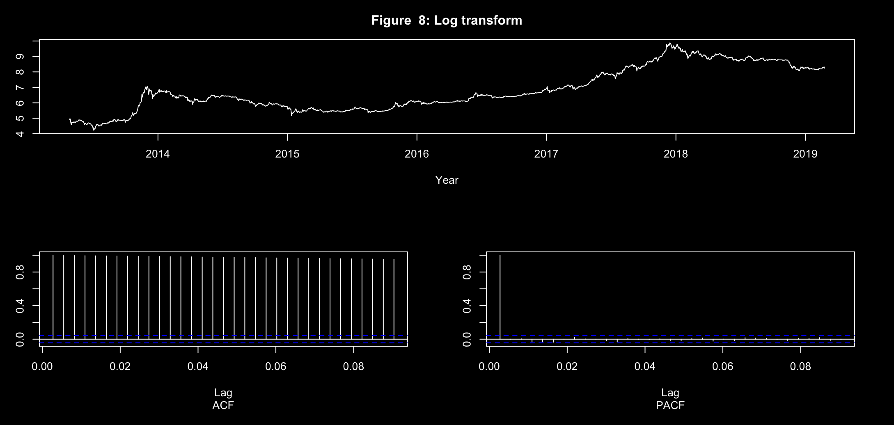

<Notes>
Series is still not stationary so we will proceed to take first difference
</Notes>
---

<CodeSurfer
  title="all the real work"
  code={cheating}
  steps={[
    { range: [ 1, 33 ], notes: "Next top model" },
    { range: [ 4, 7 ], notes: "We outsourced the model fitting" },
    { range: [ 17, 22 ], notes: "Checked the libraries" },
    { range: [ 32, 33 ], notes: "brooke-watson/BRRR" },
  ]}
/>

---

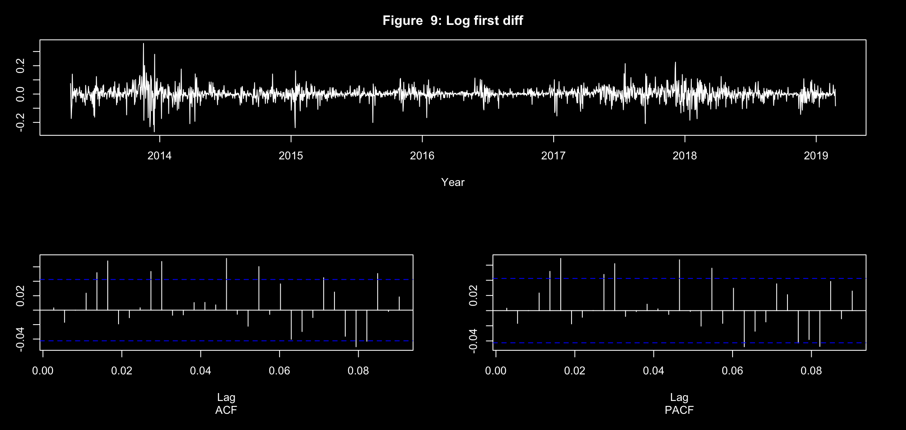

Series is stationary after log and diff = 1

---
### Everything is significant!
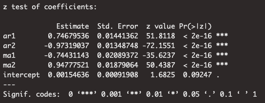
# ARIMA(2,1,2)
---
# McLeod Li Test
### Problem: they're all significant
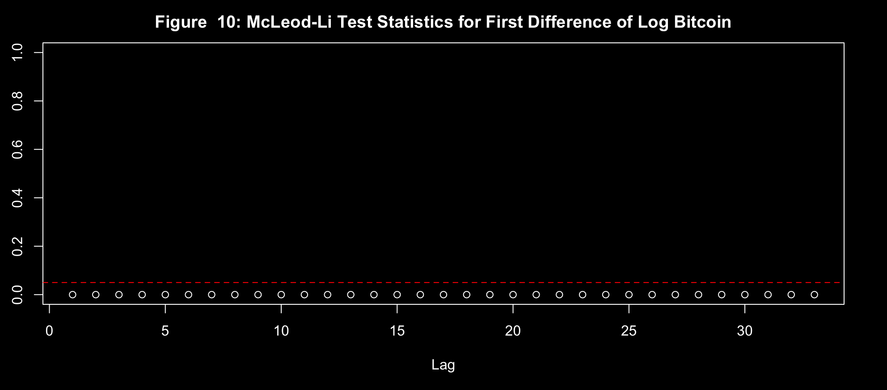

---
# Need to do GARCH!
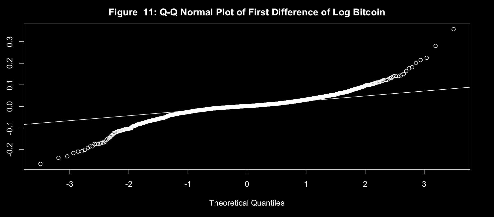

---

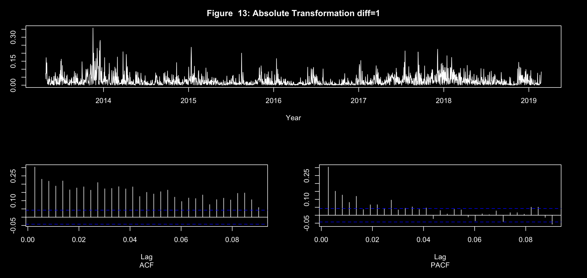

---

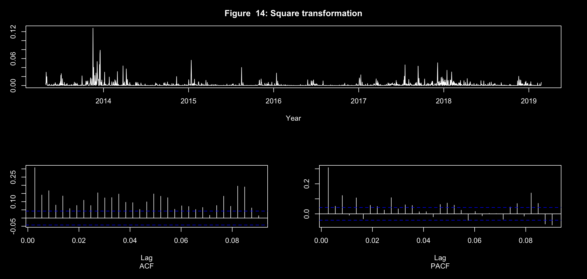

---

- `[max(2,1),1]`  => `GARCH(2,1)`
- `[max(3,2),1]`  => `GARCH(3,1)`
- `[max(4,2),1]`  => `GARCH(4,1)`

---

#### Garch(3,1) Coefficient 
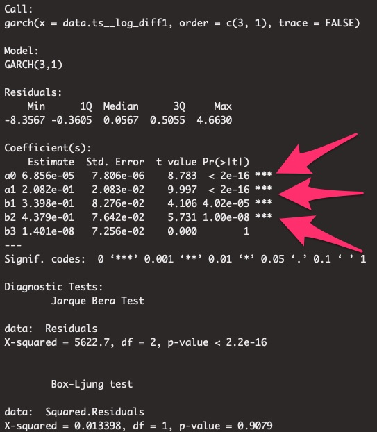

---

<CodeSurfer
  title="ARMA GARCH Forecasting"
  code={forecasting}
  steps={[
    { lines: [ 5 ], notes: "Forcast" },
    { range: [ 6, 10 ], notes: "Create the forecast model" },
    { range: [  11, 17 ], notes: "Prediction" },
    { range: [ 18, 19 ], notes: "Plotting it seems easy" },
    { range: [ 21, 26 ], notes: "This part was hard" },
    { lines: [ 28 ], notes: "Plot it" },
    { range: [ 32, 37 ], notes: "And our final predictions" },
    
  ]}
/>

---
# Some forecasts...
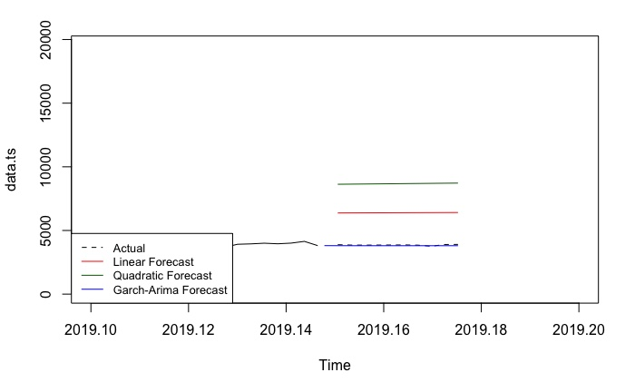
---

#### The MASE score for the GARCH-ARIMA model is the most accurate.

<ul>
  <Appear>
    <h1>GARCH-ARIMA MASE = 1.915918</h1>
    <h1>Linear MASE = 78.6479</h1>
    <h1>Quadratic MASE = 149.3758</h1>
  </Appear>
</ul>

<Notes>
- However, there are still problems in the residual analysis.
- The McLeod-Li test shows that there are still significant lags after lag 4
- The Q-Q plot still has fat tails
- This suggests that the model has not dealt completely with the volatility clustering
</Notes>
---

## Conclusion

<ul>
  <Appear>
    <h1>Volatile Clustering sucks</h1>
  </Appear>
</ul>

<Notes>``
Despite forecasting relatively accurate data, the final GARCH-ARIMA model still has signs of volatility clustering. 
Going forward, the next steps would be to fit and forecast a variety of ARIMA and GARCH parameters to fully optimise the prediction accuracy while satisfying the assumptions of the model i.e. normality of residuals.
</Notes>