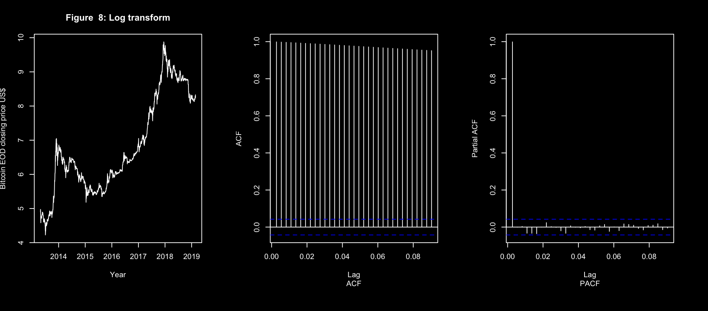
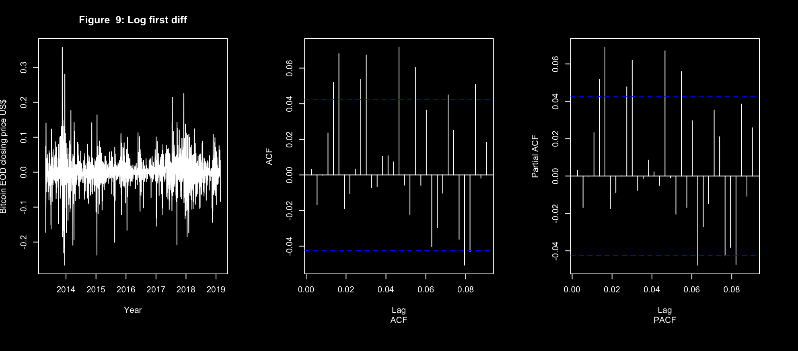
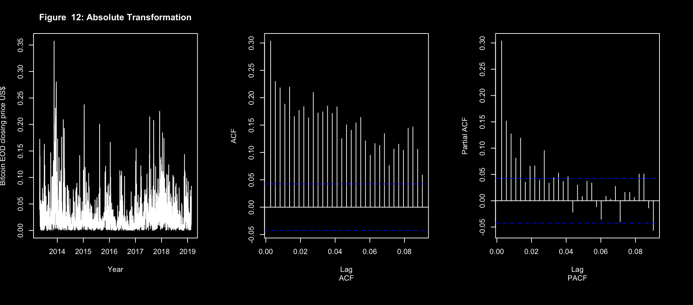
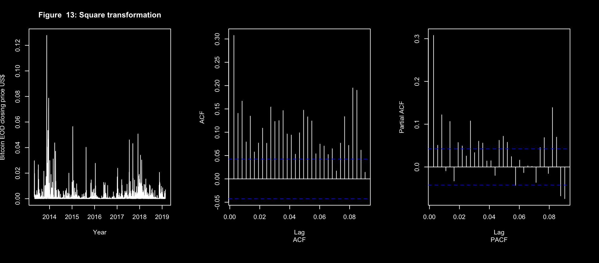
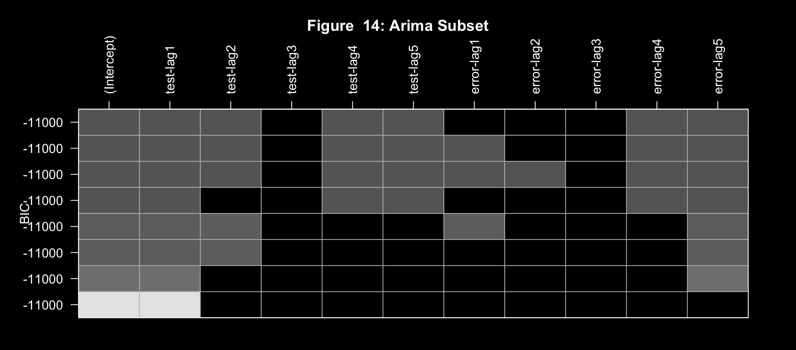

import { CodeSurfer } from "mdx-deck-code-surfer"
import { dark } from "mdx-deck/themes"
import nightOwl from "prism-react-renderer/themes/nightOwl"
import Layout from './layout.js';
import { Image } from "mdx-deck";

import assignment03 from '!raw-loader!./snippets/assignment03.mdx';
import linearModel from '!raw-loader!./snippets/linearModel.mdx';
import residualModel from '!raw-loader!./snippets/residualModel.mdx';
import quadraticModel from '!raw-loader!./snippets/quadraticModel.mdx';
import logTransformAndDiff from '!raw-loader!./snippets/logTransformAndDiff.mdx';
import garchModel from '!raw-loader!./snippets/garchModel.mdx';
import forecasting from '!raw-loader!./snippets/forecasting.mdx';

export default Layout

export { components } from "mdx-deck-code-surfer"
export const theme = {
  ...dark,
  codeSurfer: {
    ...nightOwl,
    showNumbers: false
  }
}

## Bitcoin TimeSeries
#### authors: "Phil Steinke s3725547 Ash Olney s3686808"
# <🏄/>

Source: coinmarketcap.com 
daily closing price of bitcoin from the 27th of April 2013 to the 24th of February 2019.

---

---
# The Initial Data:

- There is no overall trend
  <!-- - There was positive trend until late 2017 -->
- No obvious seasonality
- There looks like there could be an intervention point after the start of 2017
- It is evident from the plot that there are changes in variance throughout the series
- There are clusters of high and low variance

---

If the shoe fits...

- The high correlation of the data with the first lag shows that successive data points are related

---

---

<CodeSurfer
  title="Linear Model"
  code={assignment03}
  steps={[
    { notes: "Use ⬆️ and ⬇️ keys" },
    { range: [ 180, 181 ], notes: "Range" },
    { range: [ 183, 186 ], notes: "Findings" },
    { lines: [181, 187, 188, 189], notes: "... or multiple lines ➡️" },
    { range: [ 192, 197 ], notes: "Findings" },
    { lines: [199], notes: "Highlight a single line ⬇️" },
    { range: [ 204, 213 ], notes: "Residual results" }
  ]}
/>

---

### Linear trend model

- The linear model has a positive trend
- The R-Squared value of 0.47 is relatively low
- This model only explains 47% of variation in the data

---

---

---
<CodeSurfer
  title="Quadratic Model"
  code={quadraticModel}
  steps={[
    { lines: [ 5 ], notes: "Line" },
    { lines: [ 2, 5, 6 ], notes: "Lines" },
    { range: [ 4, 6 ], notes: "Range" },
    { ranges: [ [ 4, 6 ], [ 11, 14 ] ], notes: "Ranges" },
    { tokens: { 1: [ 2, 6 ] }, notes: "Tokens" },
    { range: [ 30, 33 ], notes: "Scroll" },
    { range: [ 54, 56 ], notes: "Range" },
  ]}
/>

---

<CodeSurfer
  title="Quadratic Residual Model"
  code={residualModel}
  steps={[
    { lines: [ 5 ], notes: "Line" },
    { lines: [ 2, 5, 6 ], notes: "Lines" },
    { range: [ 4, 6 ], notes: "Range" },
    { ranges: [ [ 4, 6 ], [ 11, 14 ] ], notes: "Ranges" },
    { tokens: { 1: [ 2, 6 ] }, notes: "Tokens" },
    { range: [ 30, 33 ], notes: "Scroll" },
    { range: [ 54, 56 ], notes: "Range" },
  ]}
/>

---

---

---
<CodeSurfer
  title="log Transform and Diff"
  code={logTransformAndDiff}
  steps={[
    { lines: [ 5 ], notes: "Line" },
    { lines: [ 2, 5, 6 ], notes: "Lines" },
    { range: [ 4, 6 ], notes: "Range" },
    { ranges: [ [ 4, 6 ], [ 11, 14 ] ], notes: "Ranges" },
    { tokens: { 1: [ 2, 6 ] }, notes: "Tokens" },
    { range: [ 30, 33 ], notes: "Scroll" },
    { range: [ 54, 56 ], notes: "Range" },
  ]}
/>

---

---

---

---

---

---

---

---
<CodeSurfer
  title="Garch"
  code={garchModel}
  steps={[
    { lines: [ 5 ], notes: "Line" },
    { lines: [ 2, 5, 6 ], notes: "Lines" },
    { range: [ 4, 6 ], notes: "Range" },
    { ranges: [ [ 4, 6 ], [ 11, 14 ] ], notes: "Ranges" },
    { tokens: { 1: [ 2, 6 ] }, notes: "Tokens" },
    { range: [ 30, 33 ], notes: "Scroll" },
    { range: [ 54, 56 ], notes: "Range" },
  ]}
/>

---

<CodeSurfer
  title="forecasting"
  code={forecasting}
  steps={[
    { lines: [ 5 ], notes: "Line" },
    { lines: [ 2, 5, 6 ], notes: "Lines" },
    { range: [ 4, 6 ], notes: "Range" },
    { ranges: [ [ 4, 6 ], [ 11, 14 ] ], notes: "Ranges" },
    { tokens: { 1: [ 2, 6 ] }, notes: "Tokens" },
    { range: [ 30, 33 ], notes: "Scroll" },
    { range: [ 54, 56 ], notes: "Range" },
  ]}
/>

---

<CodeSurfer
  title="All of the code"
  code={assignment03}
  steps={[
    { range: [ 102, 119 ], notes: "Range" },
  ]}
/>

---

<CodeSurfer
  title="Linear Model"
  code={assignment03}
  steps={[
    { range: [ 64, 76 ], notes: "Range" },
  ]}
/>

